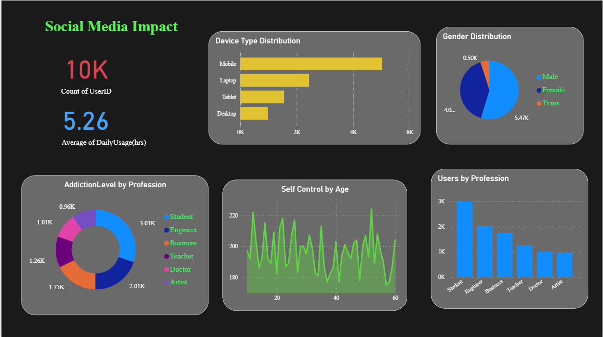
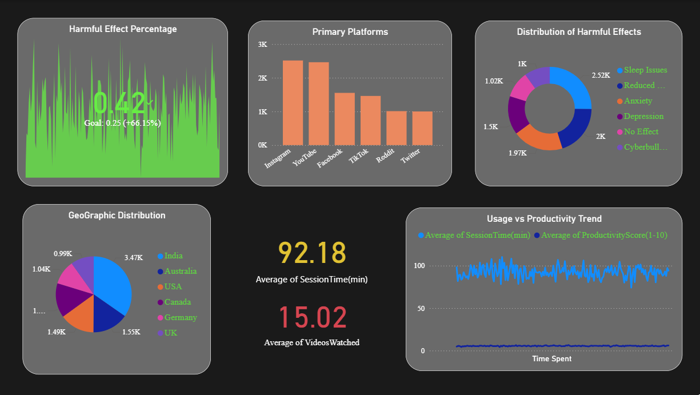

# 📊 Social Media Impact –

This project analyzes the impact of **social media usage** on users through demographic, behavioral, and psychological factors. The dashboard is built in **Power BI** and visualizes synthetic data covering user profiles, addiction levels, device preferences, harmful effects, and overall productivity.

---
## 📷 Dashboard Preview

### User Profile

### Harmful Effects

---

## 🔑 Key Insights

### User Profile & Usage Overview
- **Device Type Distribution** → Bar chart showing usage split across Mobile, Laptop, Tablet, and Desktop.
- **Gender Distribution** → Pie chart with Male, Female, and Transgender users.
- **Addiction Level by Profession** → Donut chart showing addiction levels across Students, Engineers, Business, Teachers, Doctors, and Artists.
- **Self-Control by Age** → Line chart showing variation in self-control with respect to age.
- **Users by Profession** → Bar chart showing number of users across professions.

---

### Harmful Effects & Productivity
- **KPI**:
  - Harmful Effect Percentage (vs target of 25%)
- **Primary Platforms** → Bar chart of top platforms like Instagram, YouTube, Facebook, TikTok, Reddit, and Twitter.
- **Distribution of Harmful Effects** → Donut chart showing categories such as Sleep Issues, Reduced Productivity, Anxiety, Depression, No Effect, Cyberbullying.
- **Geographic Distribution** → Pie chart showing users across India, Australia, USA, Canada, Germany, and UK.
- **Usage vs Productivity Trend** → Line chart comparing Session Time and Productivity Score.

---

## 🛠️ Tools Used
- **Power BI Desktop** → For data modeling and visualization.
- **DAX (Data Analysis Expressions)** → For simple KPIs like:
  - Harmful Effect Percentage

---

